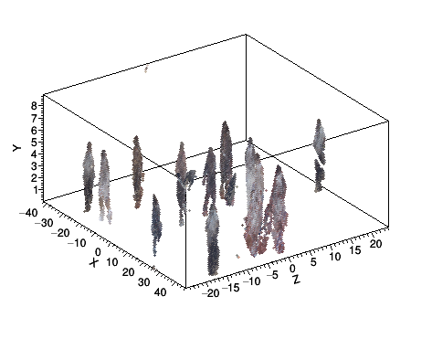
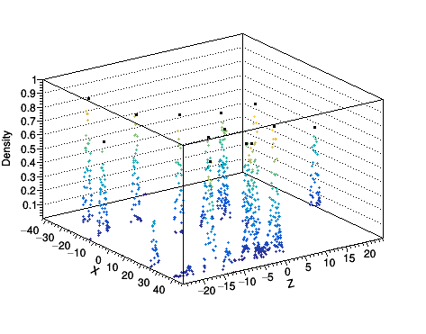
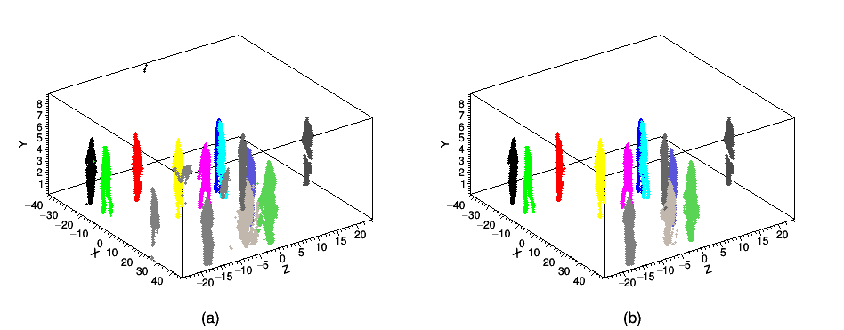
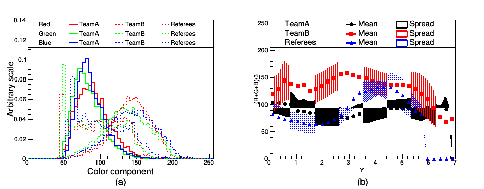
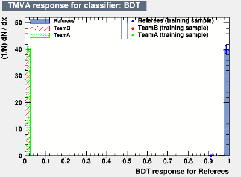
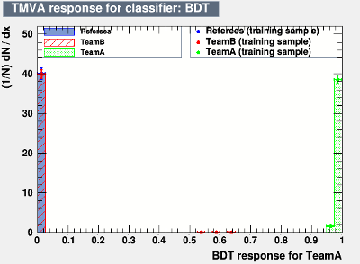
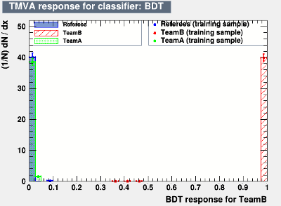
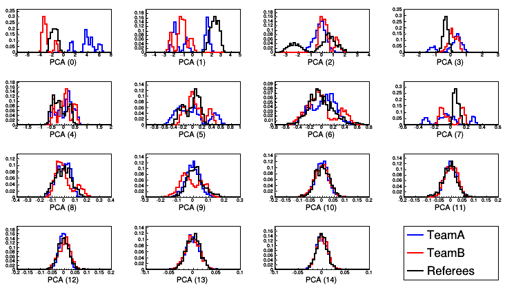
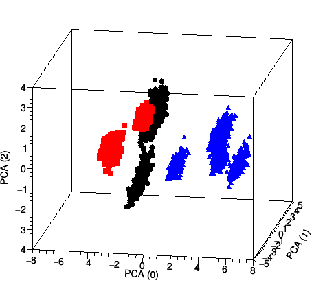
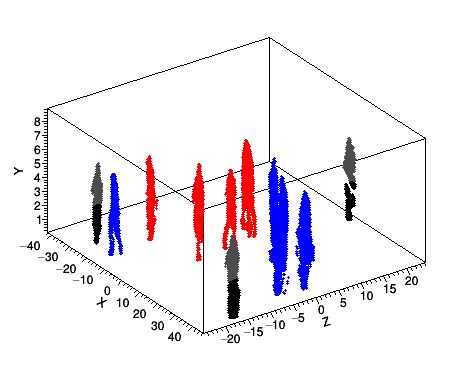

Cloud %Point Analysis {#mainpage}
=====================

Introduction:
-------------

The objective of this project is, given data from a single frame, to identify players in a basketball game, compute
their positions on the field and classify them into players belonging to two teams (TeamA and TeamB) and the Referees.
Data is provided in the form of 3D cloud points (X,Y,Z) associated to a color triplet (R,G,B). @ref Fig1 shows a 3D
view of the input cloud points.

The problem is divided into steps as follows:
- Identifying the players on the field is achieved by applying a spacial clustering algorithm with some care taken
for noise suppression.
- Classify the players into the three classes by analysing the color of the pixels within each cluster.

<table class="image" align="center">
<caption align="bottom" id="Fig1"> Fig.1: Input Data. </caption>
<tr><td></td></tr>
</table>

General Code Description:
-------------------------

For a description of the code and compiling/running instructions, see @ref md_README.

\n 

Algorithms Description:
-----------------------

### Identifying players on the field:

A spacial clustering in the horizontal (X,Z) plane is performed to identify the positions of every player on the field.

The clustering algorithm consists of the following steps:
- @b pre-clustering: This step is intended to speed-up the following steps by first grouping together
  data points that are very close to each other. The ouput of this step is the input for the actual
  clustering algorithm.
- <b> Density calculation </b>: a measure of density is needed for the following steps. The high granularity of the data allows
  to implement a density measure which does not require a kernel by simply counting the number of data points in the
  vicinity of the point of interest.
- @b Seeding: seeds are defined as local maxima of density. In order to reduce noise, only seeds with densities above a
  certain threshold are selected. A good choice of this threshold was found to be at half of the maximum density on the
  entire field. @ref Fig2 shows the density map in the (X,Z) plane and the corresponding seeds positions. 
- @b Clustering: Once the seeds are found, the clustering is performed by assigning each data point to the nearest seed.
- @b Cleaning: The final step consist of removing noise by stripping outlier data points. This is particularly important
  when performing the surface color analysis to identify the teams to which each player belongs. This cleaning is done
  by selecting data points within a certain number of standard deviations (in 2D) from the centroid of the cluster.
  Thanks to the high granularity of the data, an aggressive selection with a threshold of 1 &sigma; can be used.
  @ref Fig3 shows the result of the clustering as well as the effect of the noise removal.

<table class="image" align="center">
<caption align="bottom" id="Fig2">
Fig.2: Density map in the (X,Z) plane.
The black dots show the position of the local maxima.
</caption>
<tr><td></td></tr>
</table>

<table class="image" align="center">
<caption align="bottom" id="Fig3">
Fig.3: Players on the field after clustering (a) before and (b) after noise removal.
Each color represent a different player.
 </caption>
<tr><td></td></tr>
</table>

### Identifying the teams:

Two approaches were implemented, one of which uses supervised while the other uses unsupervised learning.
Both approaches use the same set of discriminating features.

#### The Discriminating Features:

After the players are identified on the field using spacial clustering, the color of their uniform can be used to classify
them into three categories: two teams (TeamA and TeamB) and the Referees. The RGB color components of pixels in each cluster
provide some discrimination (@ref Fig4 (a)), but it is not enough by itself at as the data presents a high spread and therefore
a large overlap between the three classes.

Instead, each cluster is divided into 5 vertical layers, and the average color components for each layer are used.
The set of discriminating variables is therefore composed of 15 (3 RGB x 5 Layers) variables. This ensures taking into account
the correlation between the color information and the position within the cluster which can be seen in @ref Fig4 (b).

<table class="image" align="center">
<caption align="bottom" id="Fig4">
Fig.4: (a) Distribution of the RGB color components of pixels from the three classes. 
(b) Profile distribution of the Gray color component of pixels from the three classes as function of the height Y.
</caption>
<tr><td></td></tr>
</table>

#### Training and evaluation data sets:

The input data is randomly split into a training and an evaluation sample:
- <b> Evaluation data: </b> Consists of 20% of the input data. The high granularity of the input data allows
  for such an assymmetric spllitting. 
- <b> Training data: </b> Consists of the remaining 80% of the input data. After spacial clustering, a bootstrap
  approach is used to generate a larger training sample. Each cluster is resampled with replacement into 300 clusters
  each containing approximately an equivalent number of points as the corresponding evaluation clusters.
  This is necessary to ensure the stability of the classification algorithm.

#### Supervised Approach:

The supervised approach assumes that the user manually analyse few frames of data to provide a training samples with "truth"
information. The trained algorithm can then be applied to rest of the frames for tracking purposes.

In this project, a multi class boosted decision tree (BDT) is implemented with three outputs (one output for each of "TeamA",
"TeamB" and "Referees" as shown in @ref Fig4). A Gradient boosting algorithm is used along with shrinkage and bagging for
regularization.
A reasonable set of default BDT parameters is chosen based on literature and prior experience. In fact, it is usually the case
that the best BDT performance is achieved for a large number of short trees (weak learners) with slow boosting (low shrinkage).
There were no optimization attempted specifically for this project as the performance of the default parameters were
satisfactory and more importantly, such optimiztion requires a larger training data set which is completely statistically
independent from the evaluation sample.
The main parameters include:
- @b NTrees = 200: Number of trees in the forest, chosen at the lowest value giving stable results to optimize for execution speed.
- @b nCuts = 20: Sampling of the input variables range while scanning for optimal cuts during individual trees training.
- @b MaxDepth = 2: Limits the depth of each tree in the forest.
- @b Shrinkage = 0.30: Shrinkage parameter controling the learning "spead" of the boosting procedure.
- @b BaggedSampleFraction = 0.50: Fraction of training data used in each step of the boosting procedure.

<table class="image" align="center">
<caption align="bottom" id="Fig5">
Fig.5: BDT response distributions for the three different classes ("Referees", "TeamA" and "TeamB").
</caption>
<tr>
<td></td>
<td></td>
<td></td>
</tr>
</table>

#### Unsupervised Approach:

A fully unsupervised approach assumes no input from the user except the data itself. It should discover the
classification by analysing the data features. The drawback is that the algorithm is unable to label the categories
as "TeamA", "TeamB" and "Referees". Therefore, the algorithm needs to be assisted by forcing the number of categories
to 3 and labeling the category with the least elements as "Referees".

In this project a Principal Component Analysis (PCA) is implemented. The 15 inputs variables are transformed using PCA
and the leading 3 components are retained. The higher order components present little to no discriminating power as can be
seen in @ref Fig6.
In this reduced phase space, a k-means clustering algorithm is implemented to perform the actual classification (@ref Fig7).
The fact that k-means algorithm require the final number of clusters to be known in advance is often quoted as one of
the limitations of the algorithm. In this appllication, it is actually a desired feature.

The parameters of the PCA transformation are computed using the bootstrapped training data. The evaluation data is
then added to the training data to perform the k-means clustering on both data sets simulatenously. This significantly
increase the stability of the clustering output.

<table class="image" align="center">
<caption align="bottom" id="Fig6">
Fig.6 Distributions of the PCA components for the different classes in the training sample.
</caption>
<tr><td></td></tr>
</table>

<table class="image" align="center">
<caption align="bottom" id="Fig7">
Fig.7 3D distribution of the three leading PCA components for the different classes in the training sample.
</caption>
<tr><td></td></tr>
</table>

### Results

Both supervised and unsupervised algorithm yield the same output:
> TeamA: [[-14.20, -21.10], [23.92, 1.37], [36.88, -4.81], [9.58, 4.94], [38.66, 0.39]]  
> TeamB: [[-19.19, -11.16], [1.43, -8.54], [-7.34, 5.37], [0.82, -1.26], [-2.41, 4.28]]  
> Referees: [[-27.44, -19.72], [6.12, 23.11], [42.17, -16.27]]  

@ref Fig8 shows a 3D view of the players after classification.

<table class="image" align="center">
<caption align="bottom" id="Fig8"> Fig.8: Output Data: TeamA in blue, TeamB in red and Referees in Gray/Black uniforms. </caption>
<tr><td></td></tr>
</table>

\n

Further Discussions:
--------------------

Several aspects of this project can still be improved. In the following I briefly discuss some of these aspects.

### Data set for training:

The data used for training in this project is highly corelated with the evaluation data and the BDT is overtrained.
In fact, if for example one player from TeamA is labeled as TeamB during training, it is highly probable that this
player would be labeled wrongly during the classification.

This can be solved by training on data from several frames taken at separate times during a game.
With a larger sample of training data statistically independent from the evaluation data,
a thorough optimization of the MVA algorithms can be performed as well as testing other MVAs such as Recurrent
Neural Networks or even Deep Learning.

### Few assumtions:

In this project, a few assumptions were made and taken for granted which if not valid, might break the whole
algorithm. In particular, the players are assumed to be standing up right and in contact with the floor and fully
inside the field of vision.

A player sitting on the floor is likely to be treated as noise, while a player performing a jump will have the
color vs. layer data corrupted. Also, a player who is standing halfway inside and outside the field of vision
is higly likely to be treated as noise.

All these aspects can be the subjects for further improvements.

### Speed considerations:

Several measures were taken to improve the speed of execution. Most of these are merely good coding practices such as
passing arguments by reference, and caching results of expensive operations, etc... Others impose modifications to
the algorithms themselves, in particular:
- The pre-clustering step is completely unnecessary in terms of the output of the algorithm but it speeds up the
clustering step by a factor of 50 in this particular case.
- The speed of execution of the BDT increases significantly with the number and depth of the decision trees in the BDT.
These parameters were reduced to the minimum values that yield stable results. As an example, the execution time
was seed up by a factor 10 with no visible impact on performance by reducing the depth of the trees from 4 to 2 and
reducing the number of trees in the forest from 1000 to 200.

\n
